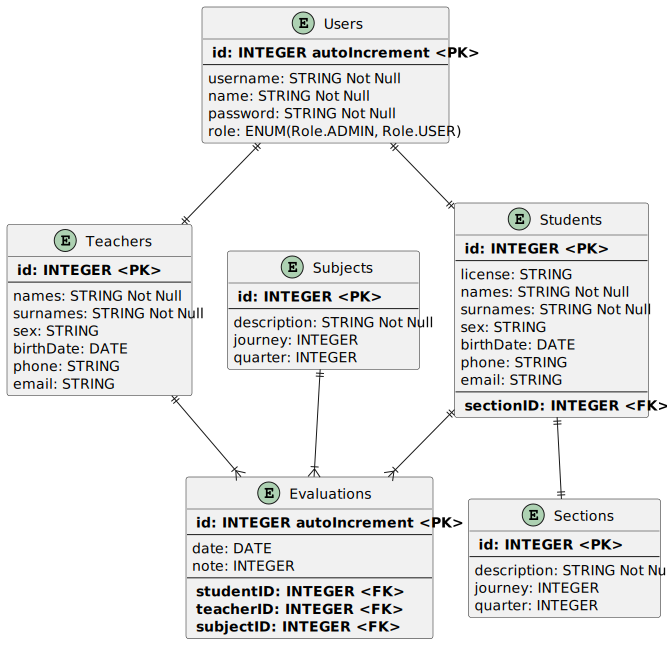

# AppNoteUpload-Back

## Overview

### Project Name: Note Upload Management API (AppNoteUpload)

### Technologies Used:

- **Node.js:** Platform to build the backend application.

- **Express:** Framework to manage routes and middleware.

- **bcrypt:** Library to encrypt passwords before storing them in the database.

- **jsonwebtoken (JWT):** Library to generate access tokens, providing secure authentication.

- **Sequelize:** ORM (Object-Relational Mapping) to interact with the database.

- **MSSQL:** Database used to store user information and other data.

## Main Features

**1. User Registration:**

- New users can register by providing a username and password.

- The password is encrypted using bcrypt before being stored in the database to improve security.

**2. User Authentication:**

- Registered users can authenticate by providing their credentials.

- If the credentials are valid, a JWT token is generated and returned to the user.

- This token is used to authorize access to protected routes in the frontend application.

**3. CRUD of Users, Students, Teachers, Sections, Subjects and Evaluations:**

- **Create:** Allows you to add new data to the database.

- **Read:** Allows you to obtain information on existing data.

- **Update:** Allows you to modify the data information.

- **Delete:** Allows you to delete information from the database.

> This project represents a robust backend API that handles user management with registration, authentication and CRUD operations functionalities. It uses bcrypt to secure passwords and jsonwebtoken to manage access tokens, providing a solid foundation for integrating with a frontend.

# Screenshots

